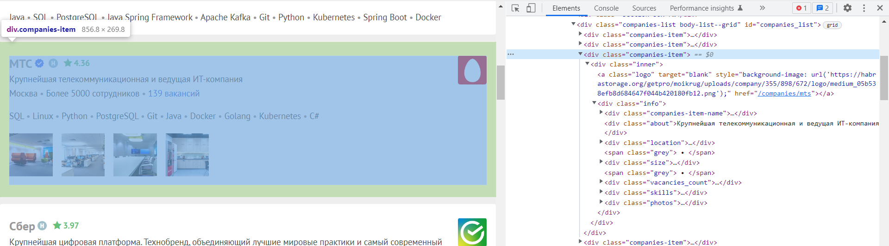
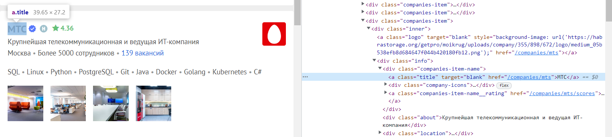
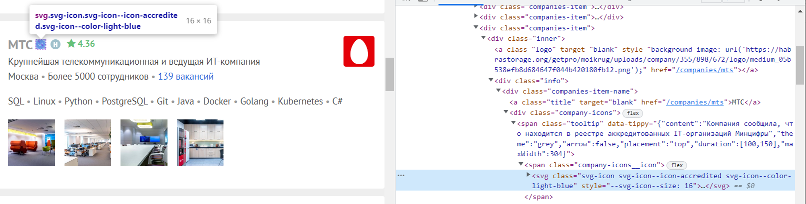
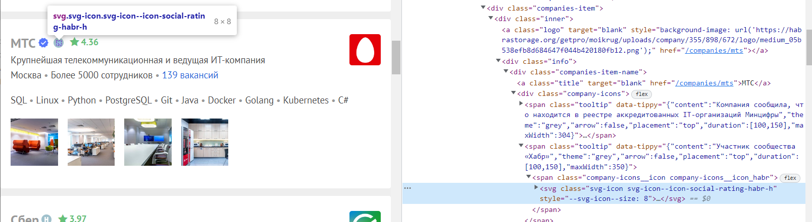
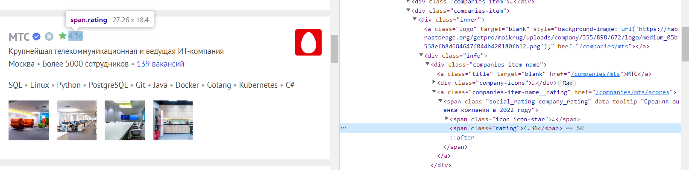
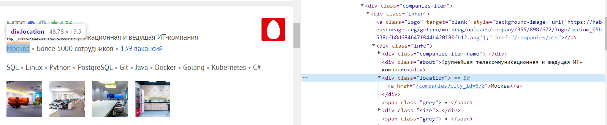
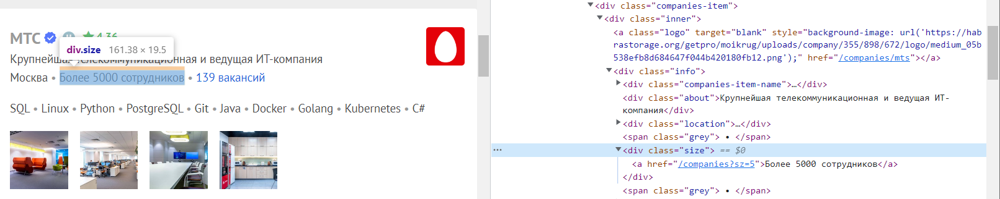
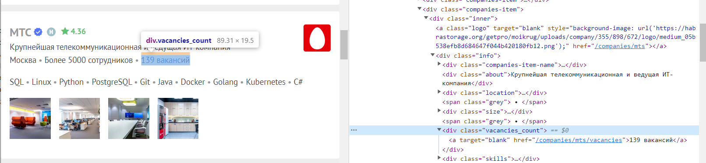
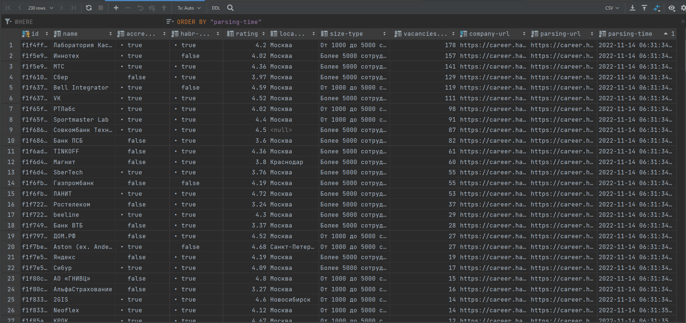
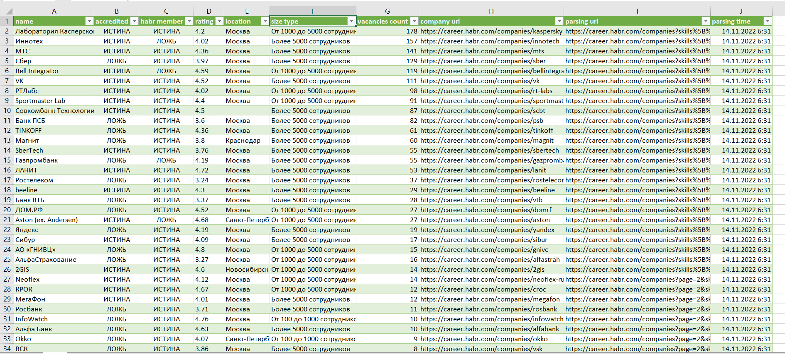

### Задача: 
Спарсить не менее 200-300 записей с какого-нибудь сайта, у каждой записи минимум 5 полей + Url + parsingTime
### Использовались:
  - Java
  - Jsoup - библиотека для для работы с контентом на основе HTML
  - Apache Commons CSV - для создания CSV файла результата
  - Java.util.logging - логирование 
### Подопотный: [Хабр Карьера -> Компании](https://career.habr.com/companies?skills%5B%5D=1012&with_ratings=1) 
##### Моделька Компании: 

    public class Company implements PageItem {
        private String name;
        private Boolean isAccredited;
        private Boolean isHabrMember;
        private Double rating;
        private String location;
        private String sizeType;
        private Integer vacanciesCount;
        private String companyUrl;
        private String parsingUrl;
        private LocalDateTime parsingTime;
    }
##### Соотношения элементов:

Блок -> Company

----------------------

Блок -> name, companyUrl

----------------------

Блок -> isAccredited

----------------------

Блок -> isHabrMember

----------------------

Блок -> rating

----------------------

Блок -> location

----------------------

Блок -> sizeType

----------------------

Блок -> vacanciesCount

----------------------

### Результат: companies.csv ([тут](src/main/resources/parsingResults/companies.csv)) или в [Гугл таблице](https://docs.google.com/spreadsheets/d/18xSbQtdlC98Quq_XRqdZMmde3gbSuoq1/edit?usp=sharing&ouid=109015205729028389580&rtpof=true&sd=true)
>Сам по себе csv-файл плохо человеко-читаемый
>
>Но из него можно сделать импорт данных в Excel или в базу данных, а также передать на следующую стадию обработки данных
##### Импорт из csv-файла в таблицу PosgreSQL

##### Импорт данных из csv-файла в Excel

